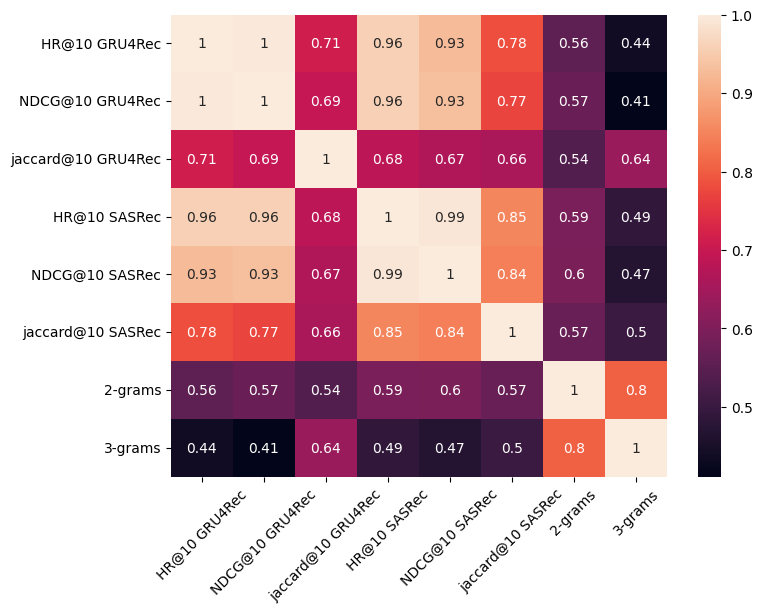
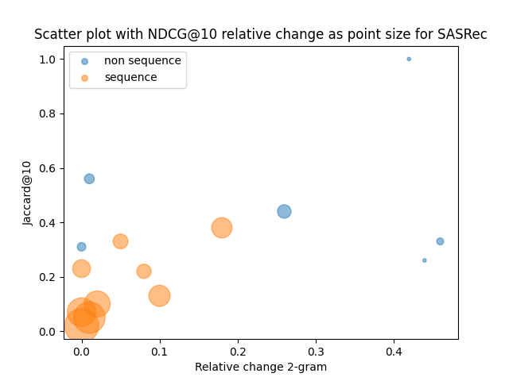
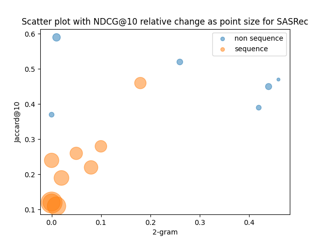

# Does It Look Sequential? An Analysis of Datasets for Evaluation of Sequential Recommendations

## Abstract
Sequential recommender systems are an important and demanded area of research. Such systems aim to use the order of interactions in a user’s history to predict future interactions. The premise is that the order of interactions and sequential patterns play an important role. Therefore, it is crucial to use datasets that exhibit a sequential structure for a proper evaluation of sequential recommenders. \
We apply several methods based on the random shuffling of the user's sequence of interactions to assess the strength of sequential structure across 15 datasets, frequently used for sequential recommender systems evaluation in recent research papers presented at top-tier conferences. As shuffling explicitly breaks sequential dependencies inherent in datasets, we estimate the strength of sequential patterns by comparing metrics for shuffled and original versions of the dataset. Our findings show that several popular datasets have a rather weak sequential structure.

## Main results
In this paper, we proposed a set of three approaches to evaluate a dataset's sequential structure strength. We further analyzed a wide range of datasets from different domains that are commonly used for the evaluation of SRSs. The results of our experiments show that many popular datasets, namely Diginetica, Foursquare, Gowalla, RetailRocket, Steam, and Yelp, lack a sequential structure.
Whether these datasets are suitable for evaluating sequential recommendations is questionable and needs further research.

The datasets selected for evaluation must be aligned with the task at hand. Conclusions drawn about the relative performance of different algorithms may change after selecting more appropriate datasets. Whether this is true or not is a possible future research direction, as well as further investigation of approaches to the assessment of sequential structure in datasets.

The methodology of our experiments included analyzing metrics based on the response to perturbations in sequences. In the "before shuffle" mode, we trained GRU4Rec and SASRec models on original sequences and monitored changes in model-based metrics (HitRate@10 (HR@10), NDCG@10, Jaccard@10), as well as computed sequential rules. In the "after shuffle" mode, for model-based metrics, we utilized perturbed sequences instead of the original ones, without altering the models trained on the original data. Sequential rules were calculated based on the perturbed sequences in this mode.

This table displays the percentage change in key metrics after shuffling according to the formula: (metric after shuffle / metric before shuffle - 1) * 100%. The metrics include HitRate, NDCG@10 for GRU4Rec and SASRec models, as well as sequential rules for 2-grams and 3-grams. Also, the table contains the Jaccard@10 after shuffle (Jaccrad@10) calculated between the model predictions with inference on the original data and perturbed data.

\* means that the bootstrap didn't show statistically significant differences between shuffle and non-shuffle ndcg metrics for the users.

| Dataset      | HR@10 GRU4Rec | NDCG@10 GRU4Rec | jaccard@10 GRU4Rec | HR@10 SASRec | NDCG@10 SASRec | jaccard@10 SASRec | 2-grams | 3-grams |
| ------------ | ------------- | --------------- | ------------------ | ------------ | -------------- | ----------------- | ------- | ------- |
| Beauty       | \-25%         | \-26%           | 0.23               | \-39%        | \-43%          | 0,24              | 0,00    | 0,00    |
| \*Diginetica | \-17%         | \-16%           | 0.44               | \-14%        | \-7%           | 0,52              | 0,26    | 0,08    |
| OTTO         | \-40%         | \-37%           | 0.13               | \-30%        | \-28%          | 0,28              | 0,10    | 0,04    |
|\*RetailRocket| \-7%          | \-5%            | 0.33               | \-4%         | \-2%           | 0,47              | 0,46    | 0,35    |
| SMM          | \-58%         | \-56%           | 0.10               | \-47%        | \-45%          | 0,19              | 0,02    | 0,02    |
| \*Sports     | \-17%         | \-18%           | 0.33               | \-28%        | \-32%          | 0,26              | 0,05    | 0,00    |
| Yoochoose    | \-26%         | \-34%           | 0.38               | \-22%        | \-27%          | 0,46              | 0,18    | 0,40    |
| Games        | \-17%         | \-17%           | 0.22               | \-33%        | \-38%          | 0,22              | 0,08    | 0,00    |
| \*Steam      | \-8%          | \-9%            | 0.56               | \-10%        | \-12%          | 0,59              | 0,01    | 0,01    |
| ML-20m       | \-63%         | \-67%           | 0.07               | \-59%        | \-61%          | 0,12              | 0,00    | 0,00    |
| 30Music      | \-95%         | \-96%           | 0.02               | \-90%        | \-92%          | 0,12              | 0,00    | 0,00    |
| Zvuk         | \-79%         | \-82%           | 0.05               | \-68%        | \-70%          | 0,11              | 0,01    | 0,00    |
| \*Foursquare | 0%            | 0%              | 1.00               | \-7%         | \-5%           | 0,39              | 0,42    | 0,45    |
| \*Gowalla    | \-5%          | \-2%            | 0.26               | \-8%         | \-8%           | 0,45              | 0,44    | 0,18    |
| \*Yelp       | \-7%          | \-7%            | 0.31               | \-2%         | 5%             | 0,37              | 0,00    | 0,00    |

## Heatmap for metrics calculated in the table.


## Scatter plot showing the relationship of model-based metrics NDCG@10 (relative change),  Jaccard@10 (after chuffle) for GRU4Rec and SASRec with 2-grams of sequential rules (relative change).





## Usage
Install requirements:
```sh
pip install -r requirements.txt
```
Specify environment variables:
```sh
# path to the project
export PATH4SEQ="/your/path"
# path to the raw data
export RECSYS_DATA_PATH="/your/path"
# path where the data will be stored after preprocessing
export PREP_DATA_PATH="/your/path"
# path where the data will be stored after split
export SPLIT_DATA_PATH="/your/path"
# path with metrics count by user
export METRICS_BY_USER_DATA_PATH="/your/path"
```

For configuration we use [Hydra](https://hydra.cc/). Parameters are specified in [config files](runs/conf/), they can be overriden from the command line. Optionally it is possible to use [ClearML](`https://clear.ml/docs/latest/docs`) for experiments logging (`project_name` and `task_name` should be specified in config to use ClearML).

Example of run via command line:
```sh
cd runs
python dl.py datasets_info=Movielens-20
```
## Reproduce paper results
Scripts to reproduce SASRec results: SASRec.sh \
Scripts to reproduce GRU4Rec results: GRU4Rec.sh \
Scripts to reproduce sequential rules: rule.sh \
Scripts to reproduce dataset statistics: statistics.sh\
Scripts to reproduce statistical test results: statistic_test.sh 


```sh
cd runs
sh SASRec.sh
sh GRU4Rec.sh
sh statistic_test.sh
sh rule.sh
sh statistics.sh
```
## Datasets selection
 In the [datasets](datasets) folder, you will find detailed information about the process of selecting datasets for this project.
